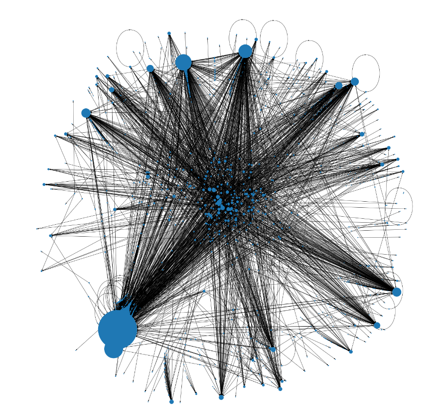
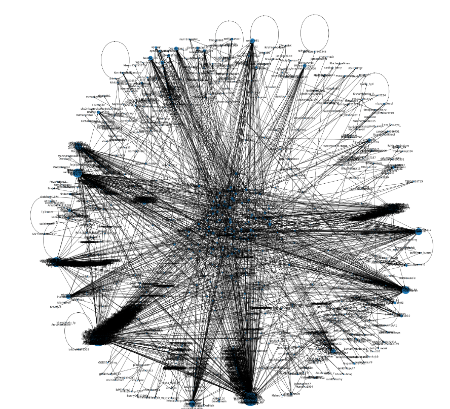

# The Adani Controversy
## Twitter Network Analysis


Adani is a big name not only in India but also globally. It’s been about three weeks since Hindenburg, a New York-based short-selling firm, accused Adani Group of “pulling the largest con in corporate history” through stock manipulation, and accounting fraud. In response to Hindenburg’s allegations, Adani Group issued a 413-page reply calling the short-sellers claims “stale, baseless, and discredited allegations.” This spiked a sort-of political debate in the country and people started questioning whether the political leaders in power had something to do with these Adani scams. We started witnessing a ton of twitter riots, the obvious memes, and also the propagation of speculated information that lacks evidence.

The allegations have nevertheless had an immediate knock-on effect, with more than $100 billion wiped from the group’s market value, as well as Gautam Adani losing his status as both Asia and India’s richest man. With the context set, now we proceed to the analysis. 

We use Network Analytics to analyze what the Twitteratis have been saying about this whole story. Check out our code as well as the summarized presentation here: https://drive.google.com/file/d/15FCGIisOBPRI5t7_EUMDn5-oHNK5fe9R/view?usp=sharing 

## Outline:
1. Data Overview
2. Metrics to evaluate top influencers
3. Network with and without top influencers


## 1. Data Overview

We scrape the data using Twitter's [tweepy](https://docs.tweepy.org/en/stable/api.html) API. Following is a code snippet that can be used to perform the same:
```
keyword = "YourQuery"
# Enter your Twitter API credentials
consumer_key = ""
consumer_secret = ""
access_token = ""
access_token_secret = ""

# Authenticate the API
auth = tweepy.OAuthHandler(consumer_key, consumer_secret)
auth.set_access_token(access_token, access_token_secret)
api = tweepy.API(auth,wait_on_rate_limit=True)

# Search for tweets with the keyword
tweets = tweepy.Cursor(api.search, q=keyword, tweet_mode = 'extended').items(20000)
```


Using the scraped data, we extract Tweet text, date, username, retweet_count. We can find the retweeters for a particular tweet using regex. In order to perform network analysis, we bring the data to the following format: 


## 2. Metrics to evaluate top influencers

In network analysis, we use centrality metrics to evaluate each node. For our project, we calculated the following metrics:
1. [Degree centrality](https://youtu.be/iiVeQkIELyc)
2. [Betweenness centrality](https://youtu.be/0CCrq62TF7U)
3. [Closeness centrality](https://youtu.be/2ELP6yd21tw)

Click on the links to know more about these metrics.
In order to rank users to find out top influencers, we used these metrics along with other metadata to get a score using which we can rank the users:
```
a, b, c, d, e, f, h = 1, 1, 1, 1, 1, 1, 1 #We can change the score to put more weightage for any metric 

final_df2['score'] = final_df2['degree']*a \
                    + final_df2['between']*b\
                    + final_df2['close']*c\
                    + final_df2['listed_count']*d\
                    + final_df2['followers_count']*e\
                    + final_df2['retweets_sent']*f\
                    + final_df2['retweets_rec']*h
```
## 3. Network with and without top influencers
This is how the network looks like with the top influencers supporting Adani:


This is how the network looks without the top influencers:



# Insights
Here are some of the insights we found during our analysis:
● Magnitude of degree centrality for top influencers among Adani supporters is higher than Anti-Adani’s top influencers
● Anti-Adani supporters are less interconnected than pro Adani supporters
● Adani supporters tend to proclaim themselves as right-leaning
● Adani denouncers tend to be liberals, proud patriots and opposition of PM Modi’s party, BJP
