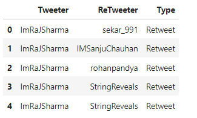

# Network-Analytics-Adani-Tweets

Adani is a big name not only in India but also globally. It’s been about three weeks since Hindenburg, a New York-based short-selling firm, accused Adani Group of “pulling the largest con in corporate history” through stock manipulation, and accounting fraud. In response to Hindenburg’s allegations, Adani Group issued a 413-page reply calling the short-sellers claims “stale, baseless, and discredited allegations.” This spiked a sort-of political debate in the country and people started questioning whether the political leaders in power had something to do with these Adani scams. We started witnessing a ton of twitter riots, the obvious memes, and also the propagation of speculated information that lacks evidence.

The allegations have nevertheless had an immediate knock-on effect, with more than $100 billion wiped from the group’s market value, as well as Gautam Adani losing his status as both Asia and India’s richest man. With the context set, now we proceed to the analysis. 

We use Network Analytics to analyze what the Twitteratis have been saying about this whole story. Check out our code as well as the summarized presentation here: https://drive.google.com/file/d/15FCGIisOBPRI5t7_EUMDn5-oHNK5fe9R/view?usp=sharing 

## Outline:
1. Data Overview
2. Metrics to evaluate top influencers
3. Network with and without top influencers


## 1. Data Overview

We scrape the data using Twitter's [tweepy](https://docs.tweepy.org/en/stable/api.html) API. Following is a code snippet that can be used to perform the same:
```
keyword = "YourQuery"
# Enter your Twitter API credentials
consumer_key = ""
consumer_secret = ""
access_token = ""
access_token_secret = ""

# Authenticate the API
auth = tweepy.OAuthHandler(consumer_key, consumer_secret)
auth.set_access_token(access_token, access_token_secret)
api = tweepy.API(auth,wait_on_rate_limit=True)

# Search for tweets with the keyword
tweets = tweepy.Cursor(api.search, q=keyword, tweet_mode = 'extended').items(20000)
```


Using the scraped data, we extract Tweet text, date, username, retweet_count. We can find the retweeters for a particular tweet using regex. In order to perform network analysis, we bring the data to the following format: 

